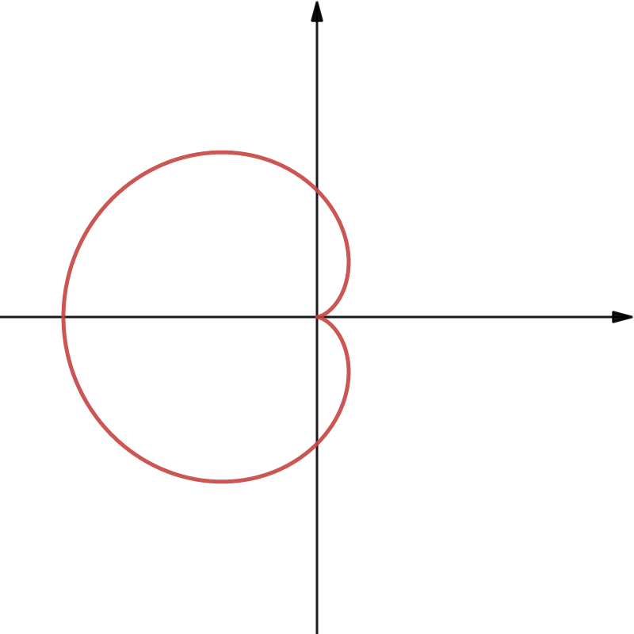
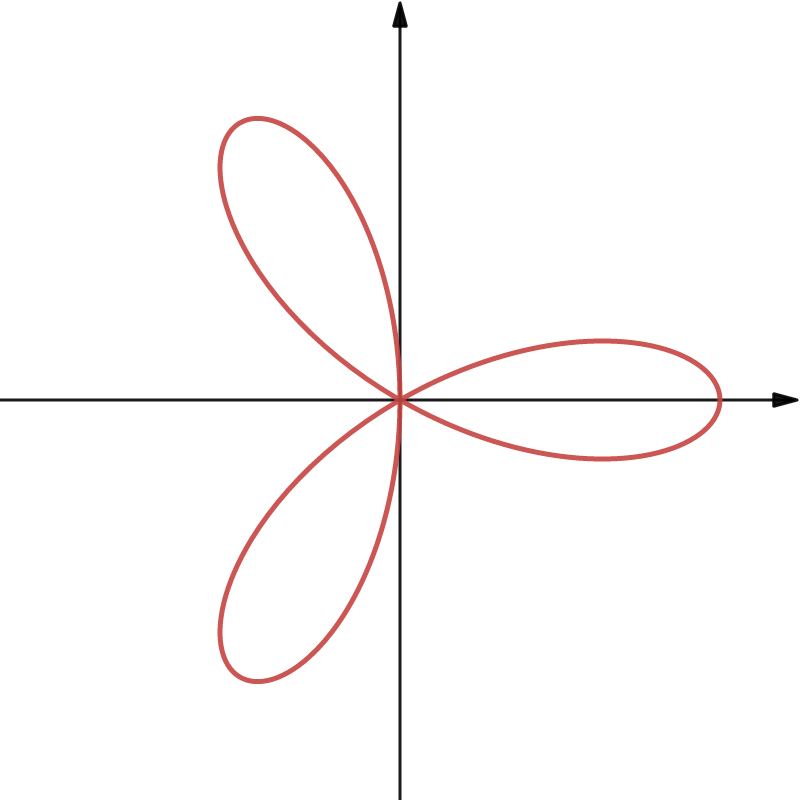
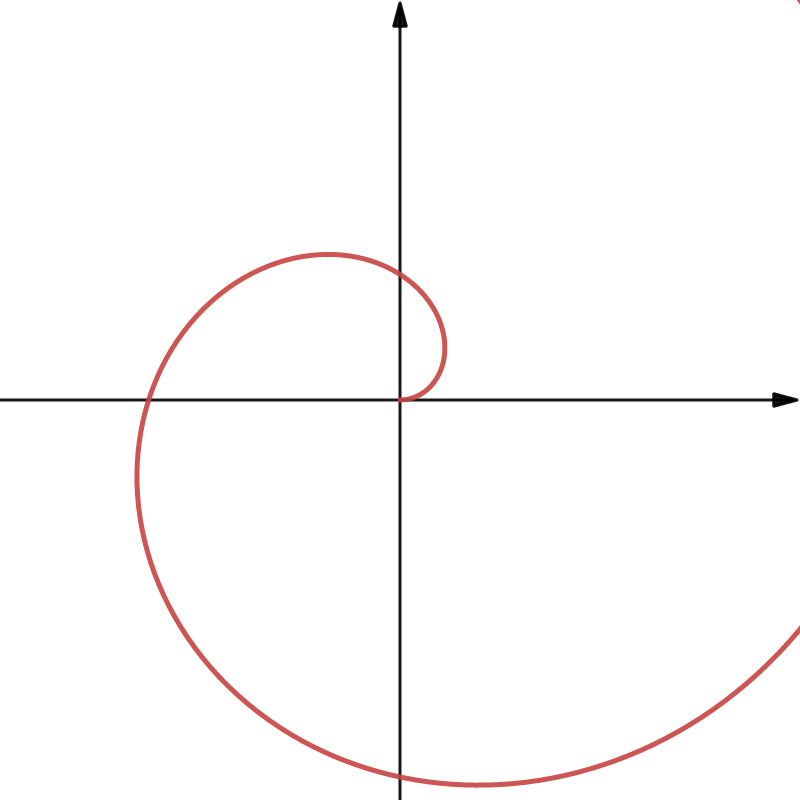
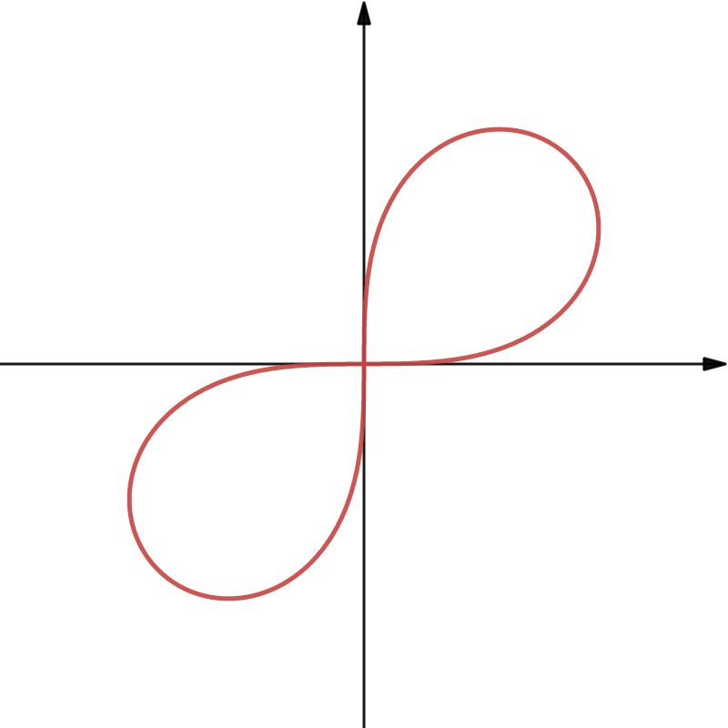
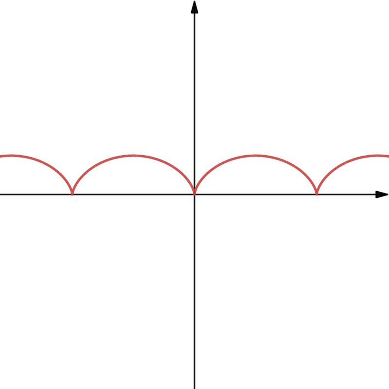
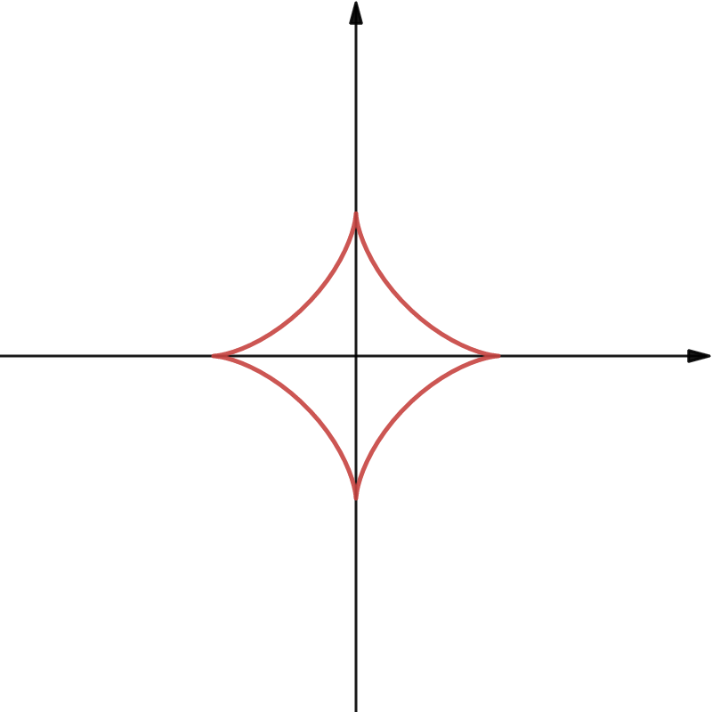

# 函数概念

## 函数

对于每一个 $x\in D$，按照一定的法则 $f$，有**一个**确定的值 $y$ 与之对应，则称 $y$ 为 $x$ 的函数，记做 $y=f(x)$. 称 $x$ 是自变量，$y$ 是因变量，数集 $D$ 是此函数的定义域。

- 可以多个 $x$ 对应一个 $y$，但不能一个 $x$ 对应多个 $y$
- 对于任一 $x$，有唯一的 $y$ 值与之对应。

## 反函数

函数 $y=f(x)$ 的定义域为 $D$,值域为 $R$.如果对于每一个 $y\in R$，必存在唯一的 $x \in D$ 使得 $y=f(x)$ 成立，则由此定义了一个新函数 $x=\varphi(x)$.这个函数就称为函数 $y=f(x)$ 的反函数，记为 $x=f^{-1}(y)$，它的定义域为 $R$，值域为 $D$，原来的函数相对于反函数称为直接函数。

- 严格单调函数必有反函数。
  - 换元法中，换元函数必须采用单调函数换元。
- 单调函数必有反函数，有反函数未必为单调函数。

## 复合函数

设函数 $y=f(u)$ 的定义域为 $D_1$，函数 $u=g(x)$ 在 $D$ 上有定义，且 $g(D)\subset D_1$，则由 $$y=f[g(x)](x\in D)$$ 确定的函数，称为由函数 $u=g(x)$ 与 $y=f(u)$ 构成的复合函数，定义域为 $D$ ，$u$ 称为中间变量。

## 函数特性与结论

### 四种特性

- 有界性
  - 讨论有界性需要指明有界区间$I$，不知区间，无法讨论有界性。
- 单调性
- 奇偶性
  - 偶函数关于$y$轴对称，奇函数关于原点对称。
  - $f(x)$为奇函数，那么$f(x)+f(-x)=0$,如果函数在原点处有定义，那么$f(0)=0$。
  - $f(x)$为偶函数，那么$f(x)=f(-x)$，如果函数在原点处有定义，那么$f^{'}(0)=0$。
  - $F_1(x)=f(x)+f(-x)$必为偶函数，$F_2(x)=f(x)-f(-x)$必为奇函数。
- 周期性

### 重要结论

- 若$f(x)$是可导偶函数，则$f^{'}(x)$是奇函数。
- 若$f(x)$是可导奇函数，则$f^{'}(x)$是偶函数。
- 若$f(x)$是可导的周期为$T$的周期函数，则$f^{'}(x)$也是周期为$T$的周期函数。
- 连续的奇函数的一切原函数都是偶函数。
- 连续的偶函数的原函数中仅有一个是奇函数。
- 若连续函数$f(x)$以$T$为周期且$\int_{0}^{T}f(x)\mathrm{d}x=0$，则$f(x)$的一切原函数也以$T$为周期。
- 若$f(x)$在$(a,b)$内可导且$f^{'}(x)$有界，则$f(x)$在$(a,b)$有界

## 初等函数

由基本初等函数经过**有限次**四则运算，以及有限次的复合步骤所构成的并且可以有一个式子所表示的函数称为**初等函数**。

### 幂函数

- 见到$\sqrt{u}$，$\sqrt[3]{u}$时，可以用$u$来研究最值，可以简化求导的计算量。
- 见到$|u|$时，由$|u|=\sqrt{u^2}$，可以用$u^2$来研究最值。
- 见到$u_1\cdotp u_2\cdotp u_3$时,可用$\ln{u_1}+\ln{u_2}+\ln{u_3}$来研究最值.
- 见到$\cfrac{1}{u}$时,可以用$u$来研究最值,他们的单调性相反,最值也相反.

### 指数函数

- 特殊函数值:$a^0=1$,$e^0=1$.
- ${\lim\limits_{x\to+\infty}}e^x=+\infty$，${\lim\limits_{x\to-\infty}}e^x=+0$，${\lim\limits_{x\to\infty}}e^x$不存在，${\int_{-\infty}^0}e^x\mathrm{d}x=1$.

### 对数函数

- 常用对数函数值:$\log_a1=0$，$\log_aa=1$，$\ln1=0$，$\ln e=1$.
- 常用公式：$x=e^{\ln x}(x>0)$，$u^v=e^{v\cdotp\ln u}(u>0)$.
- ${\lim\limits_{x\to0^+}}\ln x=0$，${\lim\limits_{x\to0^+}}x\cdot\ln x=0$，可知当$x\to0^+$时，$\ln x\to-\infty$速度很慢。

### 三角函数

- $\sec x=\cfrac{1}{\cos x}$，$\csc x=\cfrac{1}{\sin x}$.
- $\arcsin x+\arccos x=\cfrac{\pi}{2}(-1\leq x \leq1)$.
- $\arctan x+ arccot x=\cfrac{\pi}{2}$.

## 极坐标函数

### 常见图像

- 心形线：$r=a(1-\cos\theta)(a>0)$

- 玫瑰线：$r=a\cdotp\cos3\theta$

- 阿基米德螺线：$r=a\cdotp\theta$

- 伯努利双纽线：$r^2=a^2\cdotp\sin2\cdotp\theta$

### 用直角坐标系观点画极坐标系下的图像

在直角坐标系下可以方便地观察$r$与$\theta$的变化关系，进而可以较为方便地画出极坐标下的图像。

## 参数方程

- 摆线：
$$
x=r\cdotp(t-\sin t)
$$$$
y=r\cdotp(1-\cos t)
$$

- 星形线:
$$
x=r\cdotp\cos^3 t
$$$$
y=r\cdotp\sin^3 t
$$

